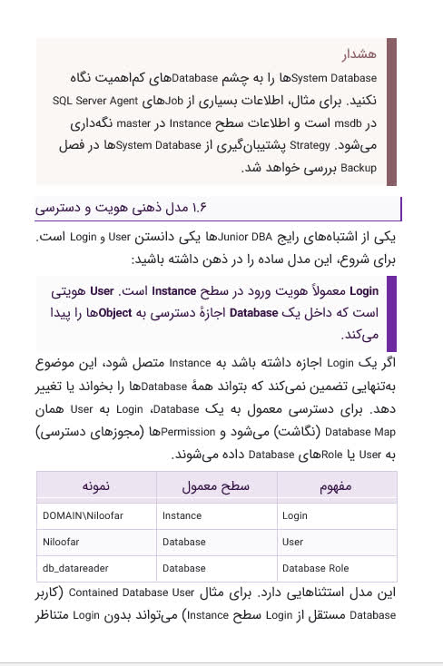
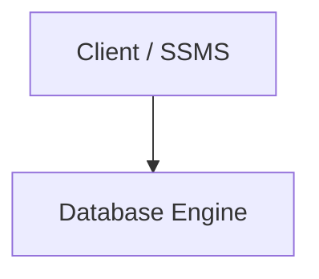

# md-to-docx

**Persian / RTL Markdown + Mermaid → Word (.docx)**

Turn bilingual technical Markdown into a styled Word document: right-to-left body text, mixed Persian/English runs, numbered heading badges, callout boxes, RTL tables, syntax-highlighted code, and high-resolution Mermaid diagrams.

<p align="center">
  
</p>
<p align="center">
  
</p>

## Why this exists

Pandoc’s default DOCX export is LTR and ignores Mermaid. Chinese `--reference-doc` templates (eastAsia fonts, first-line indent) do not produce correct Persian. This tool uses Pandoc only as a Markdown parser, then writes OOXML with python-docx so:

- Document and tables are RTL (`w:bidi`, `w:bidiVisual`)
- Complex-script fonts and sizes are set (`w:cs`, `w:szCs`, `fa-IR`)
- Heading numbers such as `۱.۴.۱` stay in the source (never auto-renumbered)
- `::: note` / `::: warning` become colored callout boxes
- Fenced `mermaid` blocks are rendered to PNG with [mermaid-cli](https://github.com/mermaid-js/mermaid-cli)

## Features

| Input | Output |
| --- | --- |
| `# ۱.۵ Title` | Purple number badge on the right + underlined title |
| Mixed `Clientها` / `SQL Server` | Script-split runs so Latin does not reverse |
| `::: note نکتهٔ DBA` | Dark purple header with `◆`, light body |
| `::: warning هشدار` | Cream box, brown title, no emoji |
| `> quote` | Thick purple **physical-right** bar + `#ECE4F1` fill |
| GFM table | Header row solid purple / white text, columns visual-RTL |
| ` ```mermaid ` + `شکل ۲-۱. …` | Centered PNG + caption |
| ` ```python ` / `sql` / `ts` | Shaded LTR code box with Pygments highlighting |

Also: GFM alerts (`> [!NOTE]`, `> [!WARNING]`), lists, images, links, bold/italic.

## Requirements

- **Python 3.11+**
- **[Pandoc](https://pandoc.org) 3.x** (parser only; it does not write the DOCX)
- **Node.js 18+** for Mermaid
- **Chrome / Chromium** (mermaid-cli / Puppeteer)

Install [Vazirmatn](https://github.com/rastikerdar/vazirmatn) on the machine that will *open* the Word file. A copy is vendored for Mermaid rendering; v1 does not embed the font inside the DOCX.

## Quick Start & Bootstrap

Run the automated one-step bootstrap script to set up Python virtualenv, Node dependencies, Puppeteer Chromium, and check Pandoc:

```bash
./scripts/bootstrap.sh
```

Or manually:

```bash
# macOS
brew install pandoc

python3.11 -m venv .venv
source .venv/bin/activate          # Windows: .venv\Scripts\activate
pip install -c constraints.txt -e ".[dev]"
npm ci || npm install

# Install Chromium for Puppeteer if needed
npx puppeteer browsers install chrome
```

`pip install -e .` puts the `md2docx` command on your PATH.

## Usage

```bash
# Basic conversion
md2docx convert chapter.md -o chapter.docx

# Overwrite existing file explicitly
md2docx convert chapter.md -o chapter.docx --overwrite

# With custom template
md2docx convert chapter.md -o chapter.docx --template purple_book
md2docx convert chapter.md -o chapter.docx --template ./templates/my_theme

# Manage templates
md2docx templates list
md2docx templates validate purple_book
```

If `-o` is omitted, the output path is the input name with a `.docx` suffix. Output must be **`.docx`** (Word 97-2003 `.doc` is rejected).

Mermaid PNGs are written as `diagram_*.png` into `{output_stem}_media` beside the DOCX (or a dedicated `media_dir` you pass to the Python API). Unrelated files in that folder are never deleted. The DOCX embeds images, so it still opens if the media folder is removed.

### CLI Exit Codes

- `0`: Successful execution.
- `1`: Conversion failure, tool execution failure (e.g. mmdc or pandoc), or permission error.
- `2`: Usage error, missing input file, directory input, output identical to input, or file collision without `--overwrite`.

Try the bundled sample:

```bash
md2docx convert tests/fixtures/sample_input.md -o sample.docx -f
```

## Pandoc AST Support Matrix

The adapter supports standard technical Markdown constructs, translating Pandoc AST nodes into high-fidelity OOXML:

| Category | Node Types | Output Behavior |
| :--- | :--- | :--- |
| **Inlines** | `Str`, `Space`, `SoftBreak`, `LineBreak` | Bidi-segmented runs, Complex Script (Vazirmatn) & Latin font matching |
| | `Strong`, `Emph` | Bold (`w:b`, `w:bCs`), Italic (`w:i`, `w:iCs`) |
| | `Strikeout` | Strikethrough (`w:strike`) |
| | `Superscript`, `Subscript` | Vertical alignment (`w:vertAlign`) |
| | `Underline` | Single underline (`w:u`) |
| | `SmallCaps` | Small caps (`w:smallCaps`) |
| | `Code` | Inline monospace code (`Courier New`), LTR run |
| | `Link`, `Quoted`, `Span` | Real `w:hyperlink` relationships; quote marks preserved; Span children rendered |
| | `Note` | Word footnotes (`word/footnotes.xml`) |
| | `Math` | Office Math (`m:oMath`) for common TeX (`\\frac`, `\\sum`, sub/sup) |
| **Blocks** | `Header` (1–6) | Level-specific size, bottom border, or RTL number badge table |
| | `Para`, `Plain` | Justified RTL/LTR body paragraphs with line spacing |
| | `BlockQuote` | Shaded box (`#ECE4F1`) with physical right border (`6B2FA0`) |
| | `Div` (Callouts) | `::: note` / `::: warning` / GFM alerts; **retains rich child formatting** (multi-paragraphs, lists, code blocks, bold/italic) |
| | `Div` (Mermaid) | Compiled via mermaid-cli to persistent PNG beside output document |
| | `Table` | Multi-tbody support, header row (`6B2FA0`), `tblGrid` explicit widths, visual-RTL (`w:bidiVisual`), optional table captions |
| | `CodeBlock` | LTR shaded container with syntax highlighting token styles |
| | `BulletList`, `OrderedList`| Indented list items with text markers |
| | `DefinitionList` | Bolded terms with indented definition descriptions |
| | `HorizontalRule` | Subtle horizontal dividing rule |
| | `RawBlock` | Raw text passthrough |

*Note: Unrecognized AST nodes raise an explicit `ConvertError` rather than being silently dropped.*

More fixtures (Persian, English, mixed) live in [`tests/fixtures/`](tests/fixtures/) and [`examples/`](examples/).

## Markdown syntax

Heading numbers are **in the Markdown**, in Persian, Arabic-Indic, or Latin digits. The converter extracts them; Word multilevel lists are not used.

````markdown
# ۱.۵ پایگاه‌های دادهٔ سیستمی SQL Server

Database Engine هستهٔ اصلی SQL Server است.

::: note نکتهٔ DBA
SSMS به Instance متصل می‌شود، نه به فایل‌های Database.
:::


شکل ۲-۱. مسیر درخواست

::: warning هشدار
از System Databaseها غافل نشوید.
:::

> Login هویت سطح Instance است. User هویت سطح Database است.

| مفهوم | سطح معمول | نمونه |
| :--- | :--- | :--- |
| Login | Instance | DOMAIN\Niloofar |
| User | Database | Niloofar |
````

Callouts also accept GFM alerts:

```markdown
> [!NOTE] Replication Lag
> Read replicas can lag during write spikes.

> [!WARNING]
> Do not evict persistent tokens.
```

A caption is the paragraph immediately after a Mermaid fence (or image) that starts with `شکل`, `Figure`, or `Fig.`.

## Templates

Each folder under `templates/` is a theme. `purple_book` is the default and matches the screenshots above.

```
templates/purple_book/
├── config.yaml                 # schema_version: 1, colors, fonts, callouts
├── mermaid.json                # mermaid-cli theme (no flowchart RTL)
├── mermaid.css
├── puppeteer.json
├── fonts/Vazirmatn-Regular.ttf # SIL OFL, used when rendering diagrams
└── shell.docx                  # optional Word shell (headers / footers)
```

Create a new theme:

```bash
cp -R templates/purple_book templates/my_theme
# edit templates/my_theme/config.yaml
md2docx templates validate my_theme
md2docx convert input.md --template my_theme -o out.docx
```

`--template` can be a name (`purple_book`) or a path to a directory that contains `config.yaml`. Paths in the YAML (Mermaid theme, CSS, fonts) are resolved relative to that directory, not the current working directory.

## How it works

```
Markdown
  → admonition preprocess (::: note Title → Pandoc fenced div)
  → mermaid-cli PNG (fail loud; never leave a raw fence)
  → pandoc -t json
  → python-docx renderer (RTL oxml, heading tables, callouts)
  → .docx
```

Pandoc is **not** used as the DOCX writer. A Chinese reference `.docx` will not give you Persian RTL.

## Development & Testing

> [!NOTE]
> System `pytest` on PATH may reference an incompatible Python interpreter. Always execute tests through the virtual environment's interpreter using `python -m pytest`:

```bash
# Setup environment & dependencies
./scripts/bootstrap.sh

# Run unit tests
source .venv/bin/activate
python -m pytest tests -q -m "not (mermaid or integration)"

# Run full test suite with skip details visible
python -m pytest tests -v -rs
```

Unit tests isolate components using mocks. Integration tests automatically probe for `pandoc` and `mmdc` (plus headless Chromium) and will run or skip based on environment availability.

```
src/md_to_docx/     CLI, pipeline, renderer, oxml helpers, bidi
templates/          visual themes (purple_book, fonts, CSS)
tests/              pytest test suite + golden Markdown fixtures
tests/fixtures/     Persian, English, and comprehensive Markdown fixtures
```

## Operational Limits & Specifications

- **Pandoc AST API Version Lock**: Explicitly locked to Pandoc API versions 1.22.x through 1.23.x (Pandoc 2.11 through 3.x). Mismatched AST versions raise an explicit `ConvertError`.
- **Raw HTML & Comments Policy**: HTML comments (`<!-- ... -->`) are suppressed from the rendered document unless they specify page breaks (`<!-- pagebreak -->`). Line breaks (`<br/>`) emit Word line breaks. Unrecognized dangerous HTML blocks (`<script>`, `<iframe>`) are rejected with `ConvertError`.
- **Image Alt Text vs. Captions**: Alt text in `` is embedded as accessibility metadata (`wp:docPr` `descr`), preventing accidental duplicate visible captions. Visible captions are rendered beneath figures only when an explicit title attribute (`"Title"`) or `Figure` caption block is provided.
- **Code Highlighting & Unknown Language Fallback**: Pygments styles code blocks with distinct token colors for Python, SQL, TypeScript, JSON, etc. Unknown language tags deterministically fall back to `TextLexer` using the configured monospace font and neutral color without guessing.
- **Dialect**: Pandoc Markdown with `fenced_divs`, `pipe_tables`, `backtick_code_blocks`, `raw_html`, and `lists_without_preceding_blankline`. This is not GitHub-only GFM and not a full HTML importer. Remote `http(s)`/`data:` images are rejected. Table rowspan/colspan is rejected.
- **Media ownership**: Only `diagram_*.png` files written by this conversion are replaced. Custom `media_dir` must be a dedicated folder (not the Markdown directory, project root, cwd, or output parent).
- **Publish locking**: An inter-process flock on `{stem}.publish.lock` serializes writers. The lock file is not deleted. Crash recovery restores the previous DOCX when a backup was taken; it is not a two-inode atomic rename of DOCX+media together.
- **Transactional Staging**: Conversion work happens in a staging directory that is always deleted. DOCX publish uses `os.replace`. Diagram files are copied individually.
- **Maximum Input File Size**: 20 MB (`MAX_INPUT_SIZE_BYTES = 20 * 1024 * 1024`). Files exceeding this limit fail immediately with `ConvertError` to prevent memory exhaustion.
- **Mermaid Compilation Timeout**: 60.0 seconds per diagram (`MERMAID_TIMEOUT_SECONDS = 60.0`).
- **Mermaid Browser Renderer**: Prefers Puppeteer-managed Chrome for Testing over system Chrome.app, passing explicit `executablePath`, `--no-sandbox`, and a matching `headless` mode (`true` for full Chrome, `shell` for chrome-headless-shell). Launch failures retry the next discovered browser. Integration tests skip unless a live mmdc probe succeeds.
- **Table Cell Spanning**: Multi-row (`rowspan > 1`) and multi-column (`colspan > 1`) cells are explicitly rejected with descriptive `ConvertError` indicating table row/column coordinates to prevent silent truncation.

## Limitations (v1)

- Heading badges and callouts are square (Word tables cannot match rounded screenshot chrome).
- Fonts are named in the document, not embedded. Recipients without Vazirmatn will see a substitute.
- Mermaid is PNG only (Word SVG support is unreliable).
- Native Word numbering definitions are not used; list markers are text (`-`, `1.`).
- `shell.docx` is single-section only (document-wide header/footer). Multi-section shells are rejected.
- Remote images and Word 97 `.doc` output are not supported.

## Fonts

[Vazirmatn](https://github.com/rastikerdar/vazirmatn) is included under the [SIL Open Font License](templates/purple_book/fonts/OFL.txt) and is used for Persian / complex-script runs (`w:cs`). Latin runs use `fonts.latin` from the theme (default **Segoe UI**). Fonts are named in the DOCX, not embedded; machines without those families will substitute.

The `purple_book` theme lives in [`templates/purple_book/`](templates/purple_book/) in this repo and is also shipped inside the Python package (`md_to_docx/templates/purple_book`) so `md2docx` works after `pip install` without a checkout.
