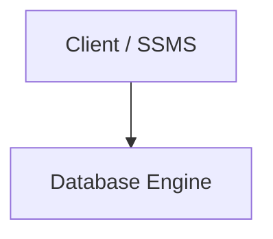

# md-to-docx

**Persian / RTL Markdown + Mermaid → Word (.docx)**

Turn bilingual technical Markdown into a styled Word document: right-to-left body text, mixed Persian/English runs, numbered heading badges, callout boxes, RTL tables, syntax-highlighted code, and high-resolution Mermaid diagrams.

<p align="center">
  
</p>
<p align="center">
  
</p>

## Why this exists

Pandoc’s default DOCX export is LTR and ignores Mermaid. Chinese `--reference-doc` templates (eastAsia fonts, first-line indent) do not produce correct Persian. This tool uses Pandoc only as a Markdown parser, then writes OOXML with python-docx so:

- Document and tables are RTL (`w:bidi`, `w:bidiVisual`)
- Complex-script fonts and sizes are set (`w:cs`, `w:szCs`, `fa-IR`)
- Heading numbers such as `۱.۴.۱` stay in the source (never auto-renumbered)
- `::: note` / `::: warning` become colored callout boxes
- Fenced `mermaid` blocks are rendered to PNG with [mermaid-cli](https://github.com/mermaid-js/mermaid-cli)

## Features

| Input | Output |
| --- | --- |
| `# ۱.۵ Title` | Purple number badge on the right + underlined title |
| Mixed `Clientها` / `SQL Server` | Script-split runs so Latin does not reverse |
| `::: note نکتهٔ DBA` | Dark purple header with `◆`, light body |
| `::: warning هشدار` | Cream box, brown title, no emoji |
| `> quote` | Thick purple **physical-right** bar + `#ECE4F1` fill |
| GFM table | Header row solid purple / white text, columns visual-RTL |
| ` ```mermaid ` + `شکل ۲-۱. …` | Centered PNG + caption |
| ` ```python ` / `sql` / `ts` | Shaded LTR code box with Pygments highlighting |

Also: GFM alerts (`> [!NOTE]`, `> [!WARNING]`), lists, images, links, bold/italic.

## Requirements

- **Python 3.11+**
- **[Pandoc](https://pandoc.org) 3.x** (parser only; it does not write the DOCX)
- **Node.js 18+** for Mermaid
- **Chrome / Chromium** (mermaid-cli / Puppeteer)

Install [Vazirmatn](https://github.com/rastikerdar/vazirmatn) on the machine that will *open* the Word file. A copy is vendored for Mermaid rendering; v1 does not embed the font inside the DOCX.

## Install

```bash
git clone https://github.com/<you>/md-to-docx.git
cd md-to-docx

# macOS
brew install pandoc

python3.11 -m venv .venv
source .venv/bin/activate          # Windows: .venv\Scripts\activate
pip install -e ".[dev]"
npm install

# if mmdc cannot find a browser
npx puppeteer browsers install chrome
```

`pip install -e .` puts the `md2docx` command on your PATH.

## Usage

```bash
md2docx convert chapter.md -o chapter.docx
md2docx convert chapter.md -o chapter.docx --template purple_book
md2docx convert chapter.md -o chapter.docx --template ./templates/my_theme

md2docx templates list
md2docx templates validate purple_book
```

If `-o` is omitted, the output path is the input name with a `.docx` suffix.

Try the bundled sample:

```bash
md2docx convert tests/fixtures/sample_input.md -o sample.docx
```

More fixtures (Persian, English, mixed) live in [`tests/fixtures/`](tests/fixtures/) and [`examples/`](examples/).

## Markdown syntax

Heading numbers are **in the Markdown**, in Persian, Arabic-Indic, or Latin digits. The converter extracts them; Word multilevel lists are not used.

````markdown
# ۱.۵ پایگاه‌های دادهٔ سیستمی SQL Server

Database Engine هستهٔ اصلی SQL Server است.

::: note نکتهٔ DBA
SSMS به Instance متصل می‌شود، نه به فایل‌های Database.
:::


شکل ۲-۱. مسیر درخواست

::: warning هشدار
از System Databaseها غافل نشوید.
:::

> Login هویت سطح Instance است. User هویت سطح Database است.

| مفهوم | سطح معمول | نمونه |
| :--- | :--- | :--- |
| Login | Instance | DOMAIN\Niloofar |
| User | Database | Niloofar |
````

Callouts also accept GFM alerts:

```markdown
> [!NOTE] Replication Lag
> Read replicas can lag during write spikes.

> [!WARNING]
> Do not evict persistent tokens.
```

A caption is the paragraph immediately after a Mermaid fence (or image) that starts with `شکل`, `Figure`, or `Fig.`.

## Templates

Each folder under `templates/` is a theme. `purple_book` is the default and matches the screenshots above.

```
templates/purple_book/
├── config.yaml                 # schema_version: 1, colors, fonts, callouts
├── mermaid.json                # mermaid-cli theme (no flowchart RTL)
├── mermaid.css
├── puppeteer.json
├── fonts/Vazirmatn-Regular.ttf # SIL OFL, used when rendering diagrams
└── shell.docx                  # optional Word shell (headers / footers)
```

Create a new theme:

```bash
cp -R templates/purple_book templates/my_theme
# edit templates/my_theme/config.yaml
md2docx templates validate my_theme
md2docx convert input.md --template my_theme -o out.docx
```

`--template` can be a name (`purple_book`) or a path to a directory that contains `config.yaml`. Paths in the YAML (Mermaid theme, CSS, fonts) are resolved relative to that directory, not the current working directory.

## How it works

```
Markdown
  → admonition preprocess (::: note Title → Pandoc fenced div)
  → mermaid-cli PNG (fail loud; never leave a raw fence)
  → pandoc -t json
  → python-docx renderer (RTL oxml, heading tables, callouts)
  → .docx
```

Pandoc is **not** used as the DOCX writer. A Chinese reference `.docx` will not give you Persian RTL.

## Development

```bash
source .venv/bin/activate
pytest
```

Unit tests mock Pandoc and mermaid-cli. Converting the large fixtures needs both binaries on `PATH`.

```
src/md_to_docx/     CLI, pipeline, renderer, oxml helpers
templates/          visual themes
tests/              pytest + golden Markdown fixtures
sample-template/    target screenshots
```

## Limitations (v1)

- Heading badges and callouts are square (Word tables cannot match rounded screenshot chrome).
- Fonts are named in the document, not embedded. Recipients without Vazirmatn will see a substitute.
- Mermaid is PNG only (Word SVG support is unreliable).
- Native Word numbering definitions are not used; list markers are text (`-`, `1.`).

## Fonts

[Vazirmatn](https://github.com/rastikerdar/vazirmatn) is included under the [SIL Open Font License](templates/purple_book/fonts/OFL.txt).
