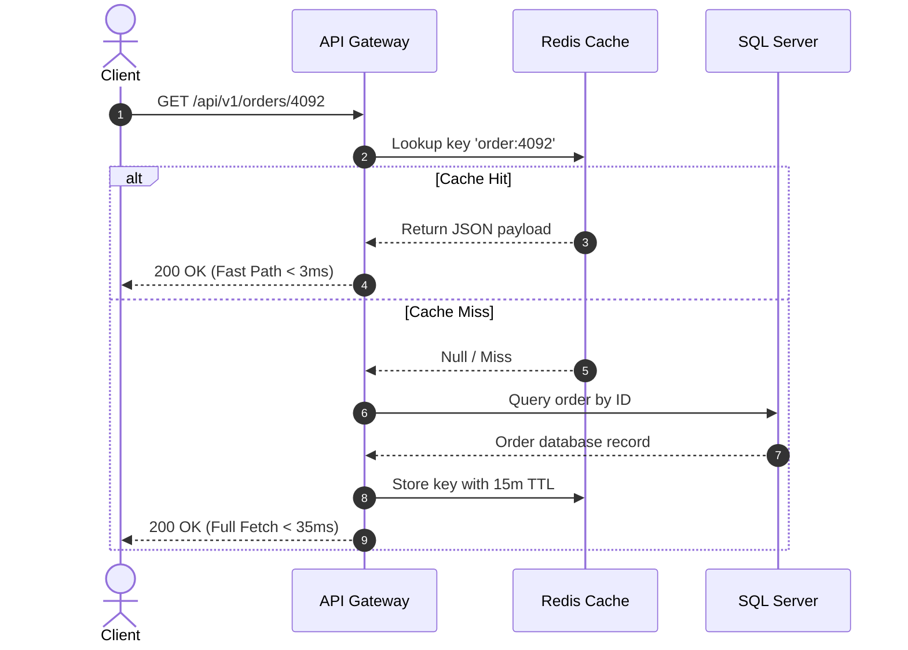

# 1.0 Distributed Cache and Persistence Architecture

This document provides a technical specification for the distributed caching layer and data synchronization pipelines deployed across high-throughput production clusters.

## 1.1 Cache-Aside Pattern and Invalidation

The caching architecture implements the standard Cache-Aside pattern combined with time-to-live (TTL) expiration and proactive write-through invalidation for sensitive database records.

> [!NOTE] Replication Lag Considerations
> Read replicas can experience brief replication lag during heavy write spikes. For strictly consistent read operations, route queries to the primary database node.

> [!WARNING] Eviction Policy Notice
> Ensure that `maxmemory-policy` is configured to `volatile-lru` in production so that persistent auth tokens are never evicted prematurely.


Figure 1. End-to-end sequence diagram demonstrating Cache-Aside lookup, miss handling, and asynchronous replenishment.

The distributed cache interface and typed fallback mechanism are implemented in TypeScript as follows:

```typescript
export interface CacheConfig {
  endpoint: string;
  port: number;
  ttlSeconds: number;
  maxRetries: number;
}

export class OrderCacheClient {
  constructor(private readonly config: CacheConfig) {}

  public async getOrder(orderId: string): Promise<Record<string, unknown> | null> {
    const key = `order:${orderId}`;
    const raw = await this.readRemote(key);
    if (!raw) return null;
    return JSON.parse(raw) as Record<string, unknown>;
  }
}
```

## 1.2 Data Access Implementation

The following Python snippet demonstrates the repository pattern with connection pooling and resilient timeout retry loops:

```python
import json
from datetime import timedelta

def fetch_order_details(order_id: int, redis_client, db_pool) -> dict:
    cache_key = f"order:{order_id}"
    cached_val = redis_client.get(cache_key)
    if cached_val:
        return json.loads(cached_val)

    with db_pool.acquire() as conn:
        record = conn.query_one("SELECT id, amount, status FROM orders WHERE id = %s", order_id)
        if record:
            redis_client.setex(cache_key, timedelta(minutes=15), json.dumps(record))
            return record
    return {}
```

The relational database persistence schema utilizes partitioned indexing to optimize range scan throughput:

```sql
-- Partitioned Orders schema with clustered index and foreign constraints
CREATE TABLE dbo.Orders (
    OrderID BIGINT IDENTITY(1,1) NOT NULL,
    CustomerID INT NOT NULL,
    OrderDate DATETIMEOFFSET NOT NULL DEFAULT SYSDATETIMEOFFSET(),
    TotalAmount DECIMAL(18, 2) NOT NULL,
    OrderStatus NVARCHAR(50) NOT NULL,
    CONSTRAINT PK_Orders PRIMARY KEY CLUSTERED (OrderID, OrderDate)
);
GO

-- Filtered nonclustered index for high-velocity pending transactions
CREATE NONCLUSTERED INDEX IX_Orders_Pending
ON dbo.Orders (CustomerID, TotalAmount)
WHERE OrderStatus = N'Pending';
GO
```

## 1.3 Cluster Node Telemetry

Production telemetry verifies memory consumption, query throughput, and p99 latency across all cluster nodes.

Cluster health monitoring daemons emit node state payloads in the following JSON schema:

```json
{
  "clusterId": "redis-cluster-eu-west-1",
  "nodeId": "redis-master-01",
  "status": "HEALTHY",
  "metrics": {
    "totalOpsPerSec": 145000,
    "hitRatio": 0.984,
    "memoryUsedBytes": 34359738368,
    "replicationLagMs": 0.35
  },
  "timestamp": "2026-09-05T14:30:00Z"
}
```


### 1.3.1 Cluster Node Status Matrix

The following table summarizes node roles, resource allocations, and operational status:

| Node Identifier | Role | Memory Allocated | Latency (p99) | Replication Status | Health |
| :--- | :--- | :--- | :--- | :--- | :--- |
| redis-master-01 | Primary | 32 GB | 0.8 ms | Primary Master | Healthy |
| redis-replica-01a | Replica | 32 GB | 1.1 ms | In-Sync (Lag 0ms) | Healthy |
| redis-replica-01b | Replica | 32 GB | 1.2 ms | In-Sync (Lag 1ms) | Healthy |
| redis-sentinel-01 | Monitor | 512 MB | 0.2 ms | Quorum Active | Healthy |

## 1.4 Maintenance and Backup Procedures

All replica snapshots are streamed to cold storage buckets nightly. Automated verification ensures RPO (Recovery Point Objective) under 15 minutes and RTO (Recovery Time Objective) under 5 minutes.
