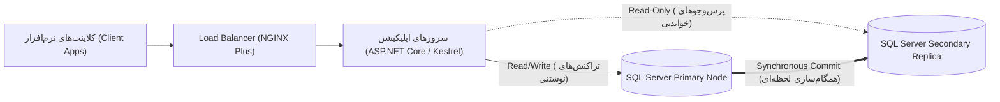

# ۱.۰ بررسی عملکرد پایگاه داده و بنچمارک سیستم (Database Performance Benchmark)

در سامانه‌های تراکنشی پرحجم (High-Throughput OLTP Systems)، پایش مداوم شاخص‌های کارایی نظیر IOPS، Latency و Throughput برای جلوگیری از گلوگاه‌های عملکردی امری ضروری است. این سند نتایج ارزیابی فنی و تست فشار سیستم را به دو زبان فارسی و انگلیسی گزارش می‌کند.

## ۱.۱ معماری کلاستر با قابلیت دسترسی‌پذیر بالا (High Availability Cluster Architecture)

ساختار خوشه‌بندی بر پایه Always On Availability Groups در محیط SQL Server Enterprise طراحی شده است. ترافیک خواندن (Read Workloads) به صورت خودکار به Read-Only Replicaها هدایت می‌شود تا فشار کاری از روی Primary Node برداشته شود.


شکل ۲-۱. ساختار افزونگی و توزیع بار خواندن در کلاستر Always On

برای بررسی لحظه‌ای وضعیت سلامت و تاخیر کلاستر Always On از پرس‌وجوی T-SQL زیر در پایگاه داده استفاده می‌شود:

```sql
-- بررسی وضعیت همگام‌سازی Always On Availability Groups (Health State & Redo Queue)
SELECT
    ar.replica_server_name AS [ReplicaNode],
    adc.database_name AS [DatabaseName],
    drs.synchronization_state_desc AS [SyncState],
    drs.synchronization_health_desc AS [HealthStatus],
    drs.redo_queue_size AS [RedoQueueKB],
    drs.log_send_queue_size AS [LogSendQueueKB]
FROM sys.dm_hadr_database_replica_states drs
INNER JOIN sys.availability_replicas ar ON drs.replica_id = ar.replica_id
INNER JOIN sys.availability_databases_cluster adc ON drs.group_database_id = adc.group_database_id
ORDER BY ar.replica_server_name;
```

> [!NOTE] تنظیم بهینهٔ MAXDOP (Max Degree of Parallelism)
> برای پایگاه‌های دادهٔ OLTP با ماهیت تراکنشی سریع، مقدار `max degree of parallelism` را متناسب با تعداد هسته‌های فیزیکی هر پردازنده (NUMA Node) تنظیم نمایید.

> [!WARNING] هشدار پیکربندی حافظه (Max Server Memory Warning)
> مقدار `Max Server Memory` در SQL Server حتماً باید حداقل ۲ تا ۴ گیگابایت کمتر از کل حافظه فیزیکی سرور (Host RAM) تعیین شود تا سیستم‌عامل با کمبود رم (Memory Starvation) مواجه نشود.

## ۱.۲ مقایسه شاخص‌های کلیدی کارایی (Key Performance Indicators)

تست‌های بنچمارک با استفاده از ابزار Apache JMeter و اجرای سناریوی همزمانی با ۵۰۰۰ کاربر مجازی انجام گرفت. نتایج زیر حاصل این آزمون‌ها است:

| مؤلفه سیستم (Component) | تکنولوژی مورد استفاده | شاخص کارایی (KPI) | مقدار هدف (Target) | مقدار اندازه‌گیری‌شده |
| :--- | :--- | :--- | :--- | :--- |
| پیام‌رسانی رویدادها | Apache Kafka 3.4 | Throughput | > 50,000 msg/sec | 68,500 msg/sec |
| ذخیره‌سازی فیزیکی داده | NVMe SSD RAID-10 | Random Read IOPS | > 80,000 IOPS | 94,200 IOPS |
| لایه حافظه موقت (Cache) | Redis 7.2 Cluster | p99 Read Latency | < 2.0 ms | 1.15 ms |
| اجرای پرس‌وجوهای پیچیده | Columnstore Index | Execution Duration | < 250 ms | 142 ms |

خروجی پیام وضعیت بنچمارک کلاستر آپاچی کافکا در قالب JSON ساختاریافته:

```json
{
  "benchmark_suite": "OLTP-Throughput-Test",
  "concurrency_level": 5000,
  "component": "Apache Kafka 3.4",
  "duration_seconds": 300,
  "metrics": {
    "total_messages_processed": 20550000,
    "throughput_msg_per_sec": 68500,
    "latency_p95_ms": 0.85,
    "latency_p99_ms": 1.15
  },
  "status": "PASSED"
}
```

اسکریپت پایتون جهت محاسبه و تحلیل صدک‌های تاخیر (Latency Percentiles) در بنچمارک سیستم:

```python
from typing import List, Dict

def calculate_latency_metrics(latencies_ms: List[float]) -> Dict[str, float]:
    """محاسبه شاخص‌های تاخیر p50، p95 و p99 برحسب میلی‌ثانیه"""
    if not latencies_ms:
        return {"p50": 0.0, "p95": 0.0, "p99": 0.0}

    sorted_lats = sorted(latencies_ms)
    n = len(sorted_lats)
    return {
        "p50": sorted_lats[int(n * 0.50)],
        "p95": sorted_lats[int(n * 0.95)],
        "p99": sorted_lats[int(n * 0.99)],
    }
```


## ۱.۳ دستورالعمل‌های عملیاتی و نگه‌داری (Maintenance Guidelines)

برای حفظ بالاترین نرخ کارایی، وظایف نگه‌داری هفتگی شامل موارد زیر است:
- بازسازی شاخص‌ها (Index Rebuild & Reorganize) بر روی جداول با پراکندگی بیش از ۲۰ درصد
- به‌روزرسانی آمارها (Update Statistics with FullScan) به صورت خودکار در ساعات کم‌ترافیک
- بررسی گزارش‌های Deadlock Analysis و اصلاح الگوهای تراکنش در سطح کدهای نرم‌افزار

اسکریپت پایش مداوم کارایی و بازسازی ایندکس‌ها با استفاده از TypeScript:

```typescript
import { ConnectionPool } from 'mssql';

interface IndexHealthReport {
  tableName: string;
  indexName: string;
  fragmentationPercent: number;
}

export async function checkFragmentation(pool: ConnectionPool): Promise<IndexHealthReport[]> {
  const query = `
    SELECT OBJECT_NAME(object_id) AS tableName, name AS indexName, avg_fragmentation_in_percent AS fragmentationPercent
    FROM sys.dm_db_index_physical_stats(DB_ID(), NULL, NULL, NULL, 'LIMITED')
    WHERE avg_fragmentation_in_percent > 20.0;
  `;
  const result = await pool.request().query<IndexHealthReport>(query);
  return result.recordset;
}
```


