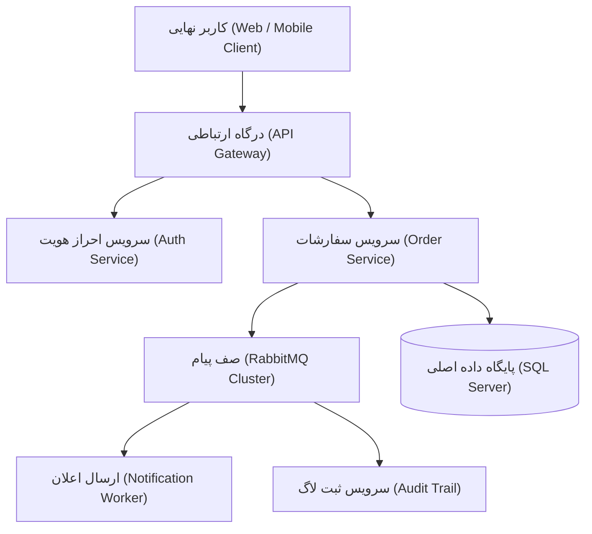

# ۱.۰ راهنمای جامع معماری داده و سرویس‌ها

در سیستم‌های توزیع‌شده امروزی، هماهنگی میان لایه‌های مختلف پردازش، ذخیره‌سازی داده و پایش سیستم نقشی اساسی در پایداری کسب‌وکار دارد. این سند معماری پایگاه داده، الگوهای تبادل پیام و رویه‌های مانیتورینگ سیستم را تشریح می‌کند.

## ۱.۱ ساختار میکروسرویس‌ها و تبادل پیام

هر سرویس موظف است پایگاه داده اختصاصی خود را بر پایه الگوی Database-per-Service نگه‌داری کند. ارتباطات همگام (Synchronous) از طریق پروتکل gRPC برای تبادل داخلی سریع و کم‌تاخیر استفاده می‌شود، در حالی که رویدادها (Domain Events) از طریق لایه Message Broker به صورت ناهمگام (Asynchronous) توزیع می‌گردند.

> [!NOTE] نکتهٔ کلیدی پایگاه داده
> همیشه اتصال‌های پایگاه داده را با Connection Pooling مدیریت کنید تا از اشباع Worker Threadها جلوگیری شود. برای سرویس‌های پربار، اندازه Pool را متناسب با ظرفیت پردازنده تنظیم نمایید.

> [!WARNING] هشدار مهاجرت داده
> پیش از اجرای Database Migration بر روی سرورهای Production، حتماً از دیتابیس پشتیبان‌گیری کامل (Full Backup) انجام دهید و اسکریپت Rollback را آزمایش کنید.


شکل ۱-۱. جریان پردازش پیام‌ها و تعامل میکروسرویس‌ها در معماری توزیع‌شده

نمونه پیام رویداد ثبت سفارش (`OrderCreated`) که در قالب JSON به صف پیام ارسال می‌شود:

```json
{
  "eventId": "evt-883491-a1b",
  "eventType": "OrderCreated",
  "aggregateId": "ord-2024-9982",
  "timestamp": "2026-09-05T14:20:00Z",
  "version": 1,
  "payload": {
    "customerId": 54021,
    "totalAmount": 18500000,
    "currency": "IRR",
    "items": [
      {
        "sku": "SRV-COMP-X1",
        "quantity": 2,
        "unitPrice": 9250000
      }
    ]
  }
}
```

برای پیاده‌سازی الگوی مطمئن Transactional Outbox در لایه داده، از ساختار جدول و پرس‌وجوی T-SQL زیر استفاده می‌شود:

```sql
-- ایجاد جدول Outbox جهت پیاده‌سازی الگوی Transactional Outbox
CREATE TABLE [dbo].[OutboxMessages] (
    [Id] UNIQUEIDENTIFIER NOT NULL DEFAULT NEWSEQUENTIALID(),
    [AggregateType] NVARCHAR(100) NOT NULL,
    [AggregateId] NVARCHAR(100) NOT NULL,
    [Type] NVARCHAR(255) NOT NULL,
    [Payload] NVARCHAR(MAX) NOT NULL,
    [CreatedAt] DATETIMEOFFSET NOT NULL DEFAULT SYSDATETIMEOFFSET(),
    [ProcessedAt] DATETIMEOFFSET NULL,
    CONSTRAINT [PK_OutboxMessages] PRIMARY KEY CLUSTERED ([Id] ASC)
);
GO

-- خواندن پیام‌های پردازش‌نشده با قفل بهینه بدون انسداد سایر تراکنش‌ها
SELECT TOP (50) [Id], [Type], [Payload]
FROM [dbo].[OutboxMessages] WITH (READPAST, UPDLOCK)
WHERE [ProcessedAt] IS NULL
ORDER BY [CreatedAt] ASC;
```

در سمت سرویس‌های پس‌زمینه (Worker Services)، پردازش ناهمگام پیام‌ها با استفاده از TypeScript پیاده‌سازی شده است:

```typescript
import { ConsumeMessage } from 'amqplib';

interface OrderEventPayload {
  eventId: string;
  aggregateId: string;
  totalAmount: number;
}

export async function processOrderMessage(msg: ConsumeMessage | null): Promise<void> {
  if (!msg) return;
  const event: OrderEventPayload = JSON.parse(msg.content.toString('utf-8'));
  console.log(`[Worker] دریافت رویداد پردازش سفارش: ${event.aggregateId}`);
  await dispatchNotification(event.eventId, event.totalAmount);
}
```

برای ارسال اعلان‌های رویداد به سرویس‌های خارجی و پردازش داده‌ها در خط لوله ETL، از کلاینت ناهمگام پایتون استفاده می‌شود:

```python
import asyncio
from typing import Dict, Any
import httpx

async def dispatch_order_notification(event: Dict[str, Any], webhook_url: str) -> bool:
    """ارسال ناهمگام اعلان رویداد سفارش به سرویس پیام‌رسان کاربری"""
    headers = {"Content-Type": "application/json", "X-Event-Source": "OrderService"}
    async with httpx.AsyncClient(timeout=5.0) as client:
        try:
            response = await client.post(webhook_url, json=event, headers=headers)
            return response.status_code == 200
        except httpx.RequestError:
            return False
```

## ۱.۲ مانیتورینگ و داشبوردهای عملیاتی

برای پایش پیوسته سلامت سرویس‌ها، از سیستم مانیتورینگ یکپارچه مبتنی بر Prometheus و Grafana استفاده می‌شود. معیارهای حیاتی نظیر نرخ خطای درخواست‌ها، میزان مصرف حافظه، و شاخص‌های تاخیر p95 و p99 به صورت لحظه‌ای ثبت و بررسی می‌گردند.


### ۱.۲.۱ تحلیل جدول مشخصات سرویس‌های کلیدی

جدول زیر خلاصه‌ای از وضعیت معماری سرویس‌های کلیدی و نیازمندی‌های شبکه و ذخیره‌سازی آن‌ها را نمایش می‌دهد:

| نام سرویس | وظیفه اصلی | پروتکل ارتباطی | سطح حساسیت | وضعیت پایداری |
| :--- | :--- | :--- | :--- | :--- |
| احراز هویت (Auth) | صدور و اعتبارسنجی JWT | gRPC / HTTPS | حیاتی (Tier 0) | پایدار و فعال |
| مدیریت کاتالوگ | ارائه لیست محصولات و قیمت‌ها | REST API / HTTPS | متوسط (Tier 2) | پایدار و فعال |
| تسویه حساب و پرداخت | اتصال به درگاه‌های بانکی شاپرک | HTTPS / Webhook | فوق‌العاده حساس | نظارت ویژه |
| رهگیری سفارش‌ها | پایش موقعیت مکانی و وضعیت انبار | WebSocket / REST | عادی (Tier 3) | پایدار و فعال |

## ۱.۳ ملاحظات امنیتی و ایزوله‌سازی منابع

امنیت لایه شبکه و ایزوله‌سازی منابع در سطح زیرساخت اعمال می‌گردد. دسترسی مستقیم به پورت‌های پایگاه داده از خارج از شبکه Private مسدود بوده و هر سرویس فقط با نام کاربری اختصاصی با حداقل اختیارات مجاز به اتصال است.


::: note نکتهٔ پایانی
تیم‌های توسعه ملزم هستند پیش از هر بارگذاری تغییرات روی محیط Production، فرایند بازبینی کد (Peer Review) و آزمون‌های بارگذاری (Load Testing) را با موفقیت سپری نمایند.
:::
