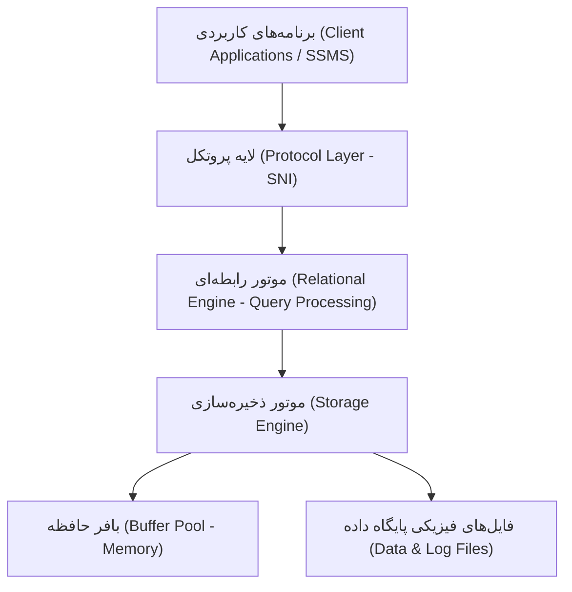

# ۱.۵ پایگاه‌های دادهٔ سیستمی SQL Server

در یک نصب معمولی SQL Server، دو نام را زیاد می‌بینید: SQL Server و Database Engine و SQL Server Agent. این دو با هم کار می‌کنند، اما یک Component واحد نیستند. هر SQL Server Instance مجموعه‌ای از System Databaseها دارد که برای کار Engine و مدیریت Instance لازم‌اند. در این فصل قرار نیست ساختار آن‌ها را باز کنیم؛ فقط می‌خواهیم نقشهٔ کلی دستمان باشد.

## ۱.۴.۱ نقش Database Engine

Database Engine هستهٔ اصلی SQL Server است. Clientها و Applicationها به Database مربوط به Instance متصل می‌شوند. Database Engine Queryها را اجرا می‌کند، Databaseها را مدیریت می‌کند، Security و Transactionها را اعمال می‌کند و عملیات خواندن و نوشتن داده را هماهنگ می‌کند.

## ۱.۴.۲ نقش SQL Server Agent

SQL Server Agent یک Windows Service جداگانه برای Automation (خودکارسازی) وظایف مدیریتی است. Jobها (کارهای زمان‌بندی‌شده) می‌توانند در زمان مشخص اجرا شوند یا مجموعه‌ای از Stepها (مراحل اجرا) را به‌ترتیب انجام دهند. Backupهای زمان‌بندی‌شده، Maintenance (نگه‌داری) و بعضی کارهای Monitoring (پایش) نمونه‌های رایج استفاده از Agent هستند.

خود Agent سرویس جداگانه‌ای است، اما اطلاعات Jobها و History مربوط به آن در System Database به نام msdb ذخیره می‌شود. این ارتباط مهم است: از نظر معماری، Jobs زیرمجموعهٔ Databaseهای کاربر نیستند، اما Metadata آن‌ها در msdb قرار می‌گیرد.

::: note نکتهٔ DBA
در شکل، SSMS و Application به Database Engine Instance متصل می‌شوند. آن‌ها مستقیماً به Windows Server یا فایل‌های Database وصل نمی‌شوند. همچنین Login در این شکل یک Principal (هویت امنیتی) سطح Instance است، نه صرفاً «صفحهٔ ورود» یک نرم‌افزار.
:::

## ۱.۴.۳ معماری داخلی SQL Server Database Engine

برای درک عملکرد SQL Server، باید مسیر یک درخواست را از لحظهٔ ارسال توسط Client تا پردازش Query، دسترسی به داده، استفاده از Memory و در نهایت ارتباط با فایل‌های Database بشناسیم. Database Engine از چند مؤلفهٔ اصلی تشکیل شده است که هرکدام مسئول بخشی از چرخهٔ اجرای درخواست هستند.


شکل ۲-۱. معماری داخلی SQL Server Database Engine و مسیر ساده‌شدهٔ پردازش درخواست‌ها

::: warning هشدار
System Databaseها را به چشم Databaseهای کم‌اهمیت نگاه نکنید. برای مثال، اطلاعات بسیاری از Jobهای SQL Server Agent در msdb است و اطلاعات سطح Instance در master نگه‌داری می‌شود. Strategy پشتیبان‌گیری از System Databaseها در فصل Backup بررسی خواهد شد.
:::

## ۱.۶ مدل ذهنی هویت و دسترسی

یکی از اشتباه‌های رایج Junior DBAها یکی دانستن User و Login است. برای شروع، این مدل ساده را در ذهن داشته باشید:

> Login معمولاً هویت ورود در سطح Instance است. User هویتی است که داخل یک Database اجازهٔ دسترسی به Objectها را پیدا می‌کند.

اگر یک Login اجازه داشته باشد به Instance متصل شود، این موضوع به‌تنهایی تضمین نمی‌کند که بتواند همهٔ Databaseها را بخواند یا تغییر دهد. برای دسترسی معمول به یک Database، همان Login به یک User نگاشت (Map) می‌شود و Permissionها (مجوزهای دسترسی) به User یا Roleهای Database داده می‌شوند.

| مفهوم | سطح معمول | نمونه |
| :--- | :--- | :--- |
| Login | Instance | DOMAIN\Niloofar |
| User | Database | Niloofar |
| Database Role | Database | db_datareader |

این مدل استثناهایی دارد. برای مثال Contained Database User (کاربر Database مستقل از Login سطح Instance) می‌تواند بدون Login متناظر کار کند.

نمونه دستورات T-SQL برای تعریف Login در سطح سرور و اعطای نقش به User در سطح Database:

```sql
-- ایجاد Login ویندوزی در سطح Instance
CREATE LOGIN [DOMAIN\Niloofar] FROM WINDOWS;
GO

-- اتصال به پایگاه داده و ایجاد User متناظر همراه با عضویت در Role
USE [SalesDatabase];
GO
CREATE USER [Niloofar] FOR LOGIN [DOMAIN\Niloofar];
ALTER ROLE [db_datareader] ADD MEMBER [Niloofar];
GO
```
