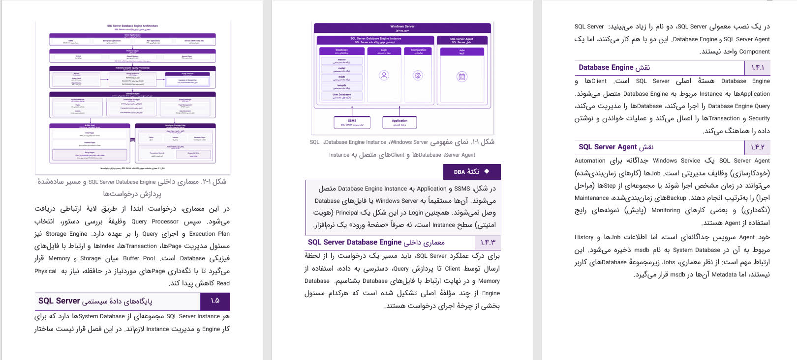

# ۱.۰ عنوان سطح یک: معماری سرویس‌ها

پاراگراف فارسی با واژگان لاتین مانند SQL Server و Docker Engine برای سنجش BiDi.

## ۱.۱ عنوان سطح دو: پیکربندی و نگارش

متن دارای استایل‌های درون‌خطی مختلف:
- متن با **حالت پررنگ (Bold)**
- متن با *حالت کج (Italic)*
- متن با ***پررنگ و کج (Bold Italic)***
- متن با ~~خط‌خورده (Strikeout)~~
- توان ریاضی ^۲^ و زیروند شیمیایی ~۲~
- کد درون‌خطی `const port = 8080;` با قلم مونو

### ۱.۱.۱ عنوان سطح سه: پیوندها و تصاویر

این یک [پیوند وب](https://example.com) است.

تصویر درون‌خطی درون متن:
شروع متن  پایان متن پاراگراف.

تصویر پیونددار:
[](https://example.com)

تصویر مستقل با عنوان:


#### ۱.۱.۱.۱ عنوان سطح چهار: لیست‌های تو در تو

1. گام اول: آماده‌سازی سرور
   1. نصب پکیج‌های پایه
   2. پیکربندی فایروال
2. گام دوم: راه‌اندازی پایگاه داده
   - ایجاد دیتابیس `ProductionDB`
   - ایجاد کاربر ادمین

##### ۱.۱.۱.۱.۱ عنوان سطح پنج: نقل‌قول و تعاریف

> این یک نقل‌قول چندخطی است.
> 
> خط دوم نقل‌قول که برای توضیح تکمیلی آمده است.

اصطلاح اول
: تعریف اصطلاح اول در لیست تعاریف

###### ۱.۱.۱.۱.۱.۱ عنوان سطح شش: جدول‌ها و فرمول‌ها

| شناسه | نام مؤلفه | پروتکل | وضعیت |
| :--- | :--- | :---: | ---: |
| 101 | Auth Gateway | HTTPS | فعال |
| 102 | Worker Queue | AMQP | در حال پردازش |

فرمول ریاضی درون‌خطی $E = mc^2$ و فرمول مستقل:

$$
\sum_{i=1}^{n} x_i = X_{total}
$$

پاورقی نمونه برای ارجاع فنی[^1].

[^1]: این متن پاورقی فنی برای سند است.

<!-- کامنت HTML که نباید در خروجی DOCX چاپ شود -->

خط اول با تگ شکست خط HTML<br/>خط دوم پس از شکست خط.

```python
# کد نمونه پایتون
def calculate_metrics(items: list) -> int:
    return sum(x * 2 for x in items)
```

```sql
SELECT id, name, status FROM Services WHERE active = 1;
```

::: note نکتهٔ اجرایی در کادر
متن راهنما درون کادر یادداشت همراه با بلاک کد تو در تو:

```typescript
const isServiceHealthy = (status: number): boolean => status === 200;
```
:::

