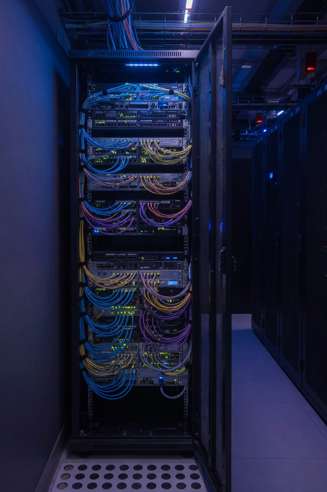
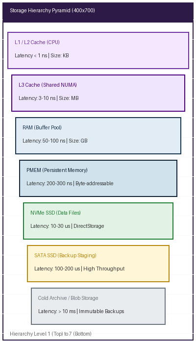
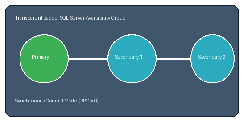
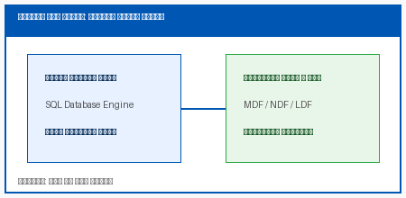

# تصاویر و نمودارهای معماری پایگاه داده

در این بخش انواع تصاویر با ابعاد و فرمت‌های مختلف آزمایش می‌شوند.

شکل ۱-۱. نمای افقی سالن سرور برای آزمون نسبت ابعاد

شکل ۱-۲. نمای عمودی رک برای آزمون ارتفاع قابل استفاده و caption

مرجع تصویر با عنوان: 
