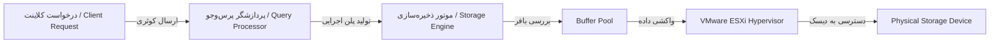
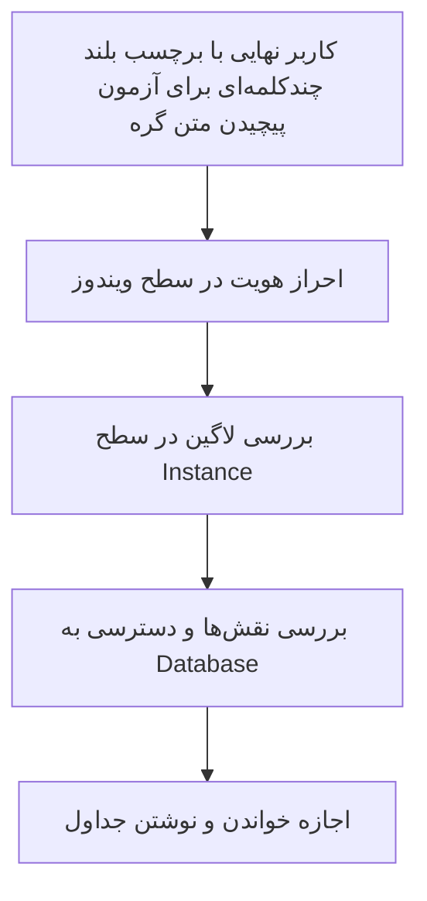

# نمودارهای جریان فرآیندها (Mermaid Flowchart)

## دیاگرام افقی جریان پردازش کوئری

شکل ۲-۱. مسیر جریان داده از کلاینت تا دیسک فیزیکی

## دیاگرام عمودی لایه‌های امنیتی

شکل ۲-۲. لایه‌های سلسله‌مراتبی امنیت و دسترسی
