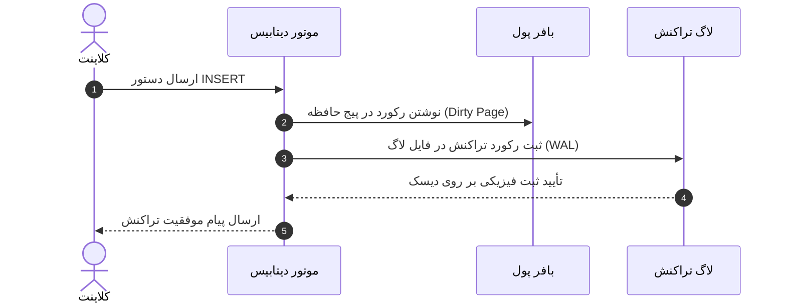
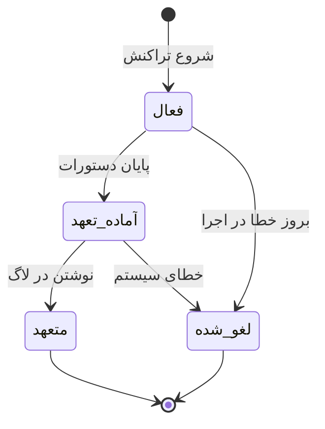
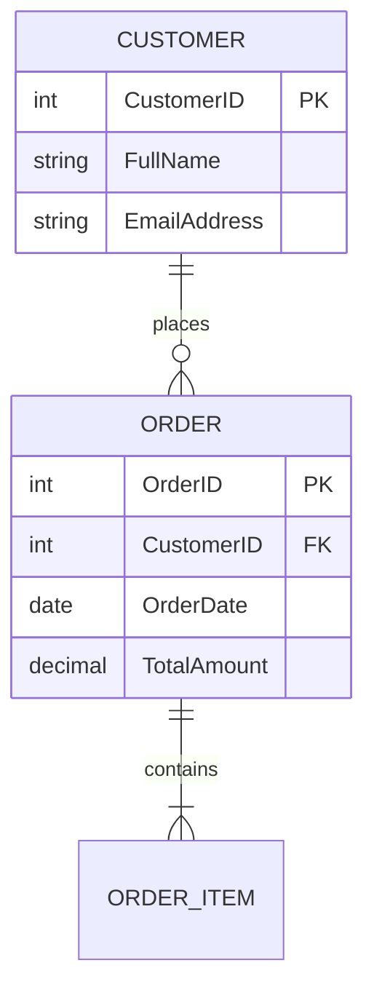

# نمودارهای پیشرفته توالی، وضعیت و موجودیت-رابطه

## نمودار توالی ثبت تراکنش در Transaction Log

```mermaid
sequenceDiagram
    autonumber
    actor Client as کلاینت
    participant Engine as موتور دیتابیس
    participant BP as بافر پول
    participant Log as لاگ تراکنش

    Client->>Engine: ارسال دستور INSERT
    Engine->>BP: نوشتن رکورد در پیج حافظه (Dirty Page)
    Engine->>Log: ثبت رکورد تراکنش در فایل لاگ (WAL)
    Log-->>Engine: تأیید ثبت فیزیکی بر روی دیسک
    Engine-->>Client: ارسال پیام موفقیت تراکنش
```

## نمودار وضعیت چرخه حیات تراکنش

```mermaid
stateDiagram-v2
    [*] --> فعال: شروع تراکنش
    فعال --> آماده_تعهد: پایان دستورات
    آماده_تعهد --> متعهد: نوشتن در لاگ
    فعال --> لغو_شده: بروز خطا در اجرا
    آماده_تعهد --> لغو_شده: خطای سیستم
    متعهد --> [*]
    لغو_شده --> [*]
```

## نمودار موجودیت-رابطه (ER Diagram)

```mermaid
erDiagram
    CUSTOMER ||--o{ ORDER : places
    ORDER ||--|{ ORDER_ITEM : contains
    CUSTOMER {
        int CustomerID PK
        string FullName
        string EmailAddress
    }
    ORDER {
        int OrderID PK
        int CustomerID FK
        date OrderDate
        decimal TotalAmount
    }
```
