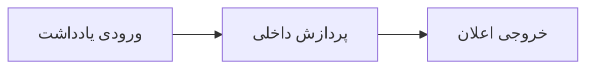
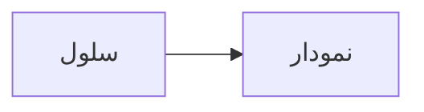

# دیاگرام‌ها و تصاویر در ظروف تودرتو

::: note
دیاگرام درون کادر اعلان:


:::

> نقل‌قول حاوی تصویر:
> 
> تصویر کوچک در بالا نمونه‌ای از جاسازی دارایی در بلوک نقل‌قول است.

فهرست حاوی دیاگرام:

* مرحله اول: دریافت درخواست
* مرحله دوم: بررسی گرافیکی فرآیند:
  ```mermaid
  flowchart LR
      X[شروع بررسی] --> Y[تأیید مجوز]
  ```
* مرحله سوم: تکمیل فرآیند

تعریف‌نامه حاوی دیاگرام:

موتور رابطه
: لایهٔ پردازش کوئری

  ```mermaid
  flowchart TB
      Q[Query] --> P[Plan]
  ```

متن دارای پاورقی با تصویر و دیاگرام.[^nest]

<table>
<thead>
<tr><th>محل</th><th>رسانه</th></tr>
</thead>
<tbody>
<tr>
<td>سلول جدول</td>
<td>



</td>
</tr>
</tbody>
</table>

[^nest]: پاورقی تودرتو شامل تصویر است.

    
