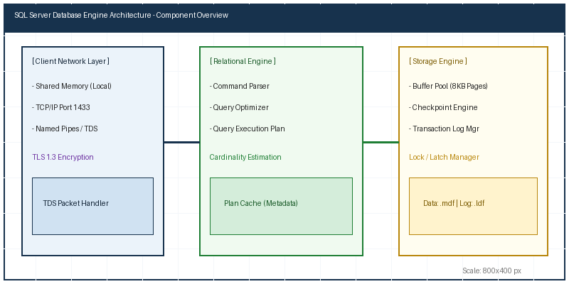

# پیش‌گفتار و راهنمای مطالعه

این کتابچه راهنمای عملیاتی جامع برای مدیران پایگاه داده (DBA) است که تمامی مفاهیم از نصب و پیکربندی اولیه تا پایش و نگه‌داری را پوشش می‌دهد.

::: {custom-style="Chapter Overview"}
در این سند راهنما • ساختار پایگاه داده و فایل‌ها • پیکربندی بهینه سخت‌افزار • تنظیمات امنیتی لاگین‌ها • دستورات پایش کارایی مورد بررسی قرار گرفته است.
:::

## ۱. مفاهیم پایه و معماری حافظه

موتور رابطه (Relational Engine) و موتور ذخیره‌سازی (Storage Engine) دو بخش اساسی در پردازش درخواست‌ها هستند.


شکل ۱-۱. معماری درونی موتور پایگاه داده


شکل ۱-۲. دیاگرام جریان درخواست‌ها در لایه‌های مختلف

::: {custom-style="DBA Note"}
نکتهٔ DBA در خصوص حافظه: همواره سقف Max Server Memory را مشخص کنید تا سیستم‌عامل دچار کمبود حافظه نگردد.
:::

## ۲. پارامترهای پیکربندی سرور

| ردیف | نام پارامتر | مقدار پیشنهادی | ضرورت |
| :--- | :--- | :--- | :--- |
| ۱ | Max Server Memory | محاسبه بر اساس فرمول | الزامی |
| ۲ | Cost Threshold for Parallelism | ۵۰ | پیشنهادی |
| ۳ | Max Degree of Parallelism | بر اساس Core | الزامی |
| ۴ | Backup Compression Default | ۱ (فعال) | پیشنهادی |
| ۵ | Remote Admin Connections | ۱ (فعال) | الزامی |

## ۳. اسکریپت‌های مدیریت و نگه‌داری

```sql
-- استخراج مشخصات دیتابیس‌ها و فایل‌های آنها
SELECT 
    d.name AS DatabaseName,
    f.name AS LogicalFileName,
    f.physical_name AS PhysicalFilePath,
    f.size * 8 / 1024 AS SizeMB
FROM sys.databases d
JOIN sys.master_files f ON d.database_id = f.database_id;
```

## ۴. دستورالعمل‌های تکمیلی و سناریوهای پایش

چک‌لیست بررسی دوره‌ای:
* بررسی لاگ‌های خطا (SQL Server Error Logs)
* پایش فضای خالی دیسک‌ها
* بررسی اجرای موفق کارهای زمان‌بندی‌شده (Agent Jobs)
* بررسی شاخص‌های تکه‌تکه‌شدگی ایندکس‌ها

::: {custom-style="Important Note"}
توجه مهم: گزارشات هفتگی باید توسط مدیر سیستم تأیید و مستندات به‌روزرسانی شوند.
:::

## 5. بخش تخصصی شماره 5: مستندات تکمیلی عملیات

در این بخش جزئیات تکمیلی عملیات نگه‌داری سطح 5 ارائه می‌شود. مفاهیم امنیتی و پیکربندی شبکه در این مرحله دارای اهمیت اساسی هستند.

::: {custom-style="DBA Note"}
نکتهٔ DBA در بخش 5: کلیه اتصالات باید رمزنگاری TLS 1.3 داشته باشند.
:::

```sql
-- بررسی وضعیت سلامت دیتابیس شماره 5
DBCC CHECKDB (N'Production_DB_5') WITH NO_INFOMSGS, ALL_ERRORMSGS;
```

| مؤلفه | مقدار کنونی | مقدار هدف | وضعیت |
| :--- | :--- | :--- | :--- |
| CPU Utilization | 25% | < 70% | مناسب |
| Memory Usage | 45% | < 85% | مناسب |
| Disk IO Latency | 5 ms | < 15 ms | عالی |

## 6. بخش تخصصی شماره 6: مستندات تکمیلی عملیات

در این بخش جزئیات تکمیلی عملیات نگه‌داری سطح 6 ارائه می‌شود. مفاهیم امنیتی و پیکربندی شبکه در این مرحله دارای اهمیت اساسی هستند.

::: {custom-style="DBA Note"}
نکتهٔ DBA در بخش 6: کلیه اتصالات باید رمزنگاری TLS 1.3 داشته باشند.
:::

```sql
-- بررسی وضعیت سلامت دیتابیس شماره 6
DBCC CHECKDB (N'Production_DB_6') WITH NO_INFOMSGS, ALL_ERRORMSGS;
```

| مؤلفه | مقدار کنونی | مقدار هدف | وضعیت |
| :--- | :--- | :--- | :--- |
| CPU Utilization | 26% | < 70% | مناسب |
| Memory Usage | 46% | < 85% | مناسب |
| Disk IO Latency | 6 ms | < 15 ms | عالی |

## 7. بخش تخصصی شماره 7: مستندات تکمیلی عملیات

در این بخش جزئیات تکمیلی عملیات نگه‌داری سطح 7 ارائه می‌شود. مفاهیم امنیتی و پیکربندی شبکه در این مرحله دارای اهمیت اساسی هستند.

::: {custom-style="DBA Note"}
نکتهٔ DBA در بخش 7: کلیه اتصالات باید رمزنگاری TLS 1.3 داشته باشند.
:::

```sql
-- بررسی وضعیت سلامت دیتابیس شماره 7
DBCC CHECKDB (N'Production_DB_7') WITH NO_INFOMSGS, ALL_ERRORMSGS;
```

| مؤلفه | مقدار کنونی | مقدار هدف | وضعیت |
| :--- | :--- | :--- | :--- |
| CPU Utilization | 27% | < 70% | مناسب |
| Memory Usage | 47% | < 85% | مناسب |
| Disk IO Latency | 7 ms | < 15 ms | عالی |

## 8. بخش تخصصی شماره 8: مستندات تکمیلی عملیات

در این بخش جزئیات تکمیلی عملیات نگه‌داری سطح 8 ارائه می‌شود. مفاهیم امنیتی و پیکربندی شبکه در این مرحله دارای اهمیت اساسی هستند.

::: {custom-style="DBA Note"}
نکتهٔ DBA در بخش 8: کلیه اتصالات باید رمزنگاری TLS 1.3 داشته باشند.
:::

```sql
-- بررسی وضعیت سلامت دیتابیس شماره 8
DBCC CHECKDB (N'Production_DB_8') WITH NO_INFOMSGS, ALL_ERRORMSGS;
```

| مؤلفه | مقدار کنونی | مقدار هدف | وضعیت |
| :--- | :--- | :--- | :--- |
| CPU Utilization | 28% | < 70% | مناسب |
| Memory Usage | 48% | < 85% | مناسب |
| Disk IO Latency | 8 ms | < 15 ms | عالی |

## 9. بخش تخصصی شماره 9: مستندات تکمیلی عملیات

در این بخش جزئیات تکمیلی عملیات نگه‌داری سطح 9 ارائه می‌شود. مفاهیم امنیتی و پیکربندی شبکه در این مرحله دارای اهمیت اساسی هستند.

::: {custom-style="DBA Note"}
نکتهٔ DBA در بخش 9: کلیه اتصالات باید رمزنگاری TLS 1.3 داشته باشند.
:::

```sql
-- بررسی وضعیت سلامت دیتابیس شماره 9
DBCC CHECKDB (N'Production_DB_9') WITH NO_INFOMSGS, ALL_ERRORMSGS;
```

| مؤلفه | مقدار کنونی | مقدار هدف | وضعیت |
| :--- | :--- | :--- | :--- |
| CPU Utilization | 29% | < 70% | مناسب |
| Memory Usage | 49% | < 85% | مناسب |
| Disk IO Latency | 9 ms | < 15 ms | عالی |

## 10. بخش تخصصی شماره 10: مستندات تکمیلی عملیات

در این بخش جزئیات تکمیلی عملیات نگه‌داری سطح 10 ارائه می‌شود. مفاهیم امنیتی و پیکربندی شبکه در این مرحله دارای اهمیت اساسی هستند.

::: {custom-style="DBA Note"}
نکتهٔ DBA در بخش 10: کلیه اتصالات باید رمزنگاری TLS 1.3 داشته باشند.
:::

```sql
-- بررسی وضعیت سلامت دیتابیس شماره 10
DBCC CHECKDB (N'Production_DB_10') WITH NO_INFOMSGS, ALL_ERRORMSGS;
```

| مؤلفه | مقدار کنونی | مقدار هدف | وضعیت |
| :--- | :--- | :--- | :--- |
| CPU Utilization | 30% | < 70% | مناسب |
| Memory Usage | 50% | < 85% | مناسب |
| Disk IO Latency | 10 ms | < 15 ms | عالی |

## 11. بخش تخصصی شماره 11: مستندات تکمیلی عملیات

در این بخش جزئیات تکمیلی عملیات نگه‌داری سطح 11 ارائه می‌شود. مفاهیم امنیتی و پیکربندی شبکه در این مرحله دارای اهمیت اساسی هستند.

::: {custom-style="DBA Note"}
نکتهٔ DBA در بخش 11: کلیه اتصالات باید رمزنگاری TLS 1.3 داشته باشند.
:::

```sql
-- بررسی وضعیت سلامت دیتابیس شماره 11
DBCC CHECKDB (N'Production_DB_11') WITH NO_INFOMSGS, ALL_ERRORMSGS;
```

| مؤلفه | مقدار کنونی | مقدار هدف | وضعیت |
| :--- | :--- | :--- | :--- |
| CPU Utilization | 31% | < 70% | مناسب |
| Memory Usage | 51% | < 85% | مناسب |
| Disk IO Latency | 11 ms | < 15 ms | عالی |

## 12. بخش تخصصی شماره 12: مستندات تکمیلی عملیات

در این بخش جزئیات تکمیلی عملیات نگه‌داری سطح 12 ارائه می‌شود. مفاهیم امنیتی و پیکربندی شبکه در این مرحله دارای اهمیت اساسی هستند.

::: {custom-style="DBA Note"}
نکتهٔ DBA در بخش 12: کلیه اتصالات باید رمزنگاری TLS 1.3 داشته باشند.
:::

```sql
-- بررسی وضعیت سلامت دیتابیس شماره 12
DBCC CHECKDB (N'Production_DB_12') WITH NO_INFOMSGS, ALL_ERRORMSGS;
```

| مؤلفه | مقدار کنونی | مقدار هدف | وضعیت |
| :--- | :--- | :--- | :--- |
| CPU Utilization | 32% | < 70% | مناسب |
| Memory Usage | 52% | < 85% | مناسب |
| Disk IO Latency | 12 ms | < 15 ms | عالی |

## 13. بخش تخصصی شماره 13: مستندات تکمیلی عملیات

در این بخش جزئیات تکمیلی عملیات نگه‌داری سطح 13 ارائه می‌شود. مفاهیم امنیتی و پیکربندی شبکه در این مرحله دارای اهمیت اساسی هستند.

::: {custom-style="DBA Note"}
نکتهٔ DBA در بخش 13: کلیه اتصالات باید رمزنگاری TLS 1.3 داشته باشند.
:::

```sql
-- بررسی وضعیت سلامت دیتابیس شماره 13
DBCC CHECKDB (N'Production_DB_13') WITH NO_INFOMSGS, ALL_ERRORMSGS;
```

| مؤلفه | مقدار کنونی | مقدار هدف | وضعیت |
| :--- | :--- | :--- | :--- |
| CPU Utilization | 33% | < 70% | مناسب |
| Memory Usage | 53% | < 85% | مناسب |
| Disk IO Latency | 13 ms | < 15 ms | عالی |

## 14. بخش تخصصی شماره 14: مستندات تکمیلی عملیات

در این بخش جزئیات تکمیلی عملیات نگه‌داری سطح 14 ارائه می‌شود. مفاهیم امنیتی و پیکربندی شبکه در این مرحله دارای اهمیت اساسی هستند.

::: {custom-style="DBA Note"}
نکتهٔ DBA در بخش 14: کلیه اتصالات باید رمزنگاری TLS 1.3 داشته باشند.
:::

```sql
-- بررسی وضعیت سلامت دیتابیس شماره 14
DBCC CHECKDB (N'Production_DB_14') WITH NO_INFOMSGS, ALL_ERRORMSGS;
```

| مؤلفه | مقدار کنونی | مقدار هدف | وضعیت |
| :--- | :--- | :--- | :--- |
| CPU Utilization | 34% | < 70% | مناسب |
| Memory Usage | 54% | < 85% | مناسب |
| Disk IO Latency | 14 ms | < 15 ms | عالی |

## 15. بخش تخصصی شماره 15: مستندات تکمیلی عملیات

در این بخش جزئیات تکمیلی عملیات نگه‌داری سطح 15 ارائه می‌شود. مفاهیم امنیتی و پیکربندی شبکه در این مرحله دارای اهمیت اساسی هستند.

::: {custom-style="DBA Note"}
نکتهٔ DBA در بخش 15: کلیه اتصالات باید رمزنگاری TLS 1.3 داشته باشند.
:::

```sql
-- بررسی وضعیت سلامت دیتابیس شماره 15
DBCC CHECKDB (N'Production_DB_15') WITH NO_INFOMSGS, ALL_ERRORMSGS;
```

| مؤلفه | مقدار کنونی | مقدار هدف | وضعیت |
| :--- | :--- | :--- | :--- |
| CPU Utilization | 35% | < 70% | مناسب |
| Memory Usage | 55% | < 85% | مناسب |
| Disk IO Latency | 15 ms | < 15 ms | عالی |
